# GPipe 流水线时序图

> 配置：PP=4（4 个 stage），micro-batch=4（m1, m2, m3, m4）
> 单位：每个 cell = 1 个时间单位（一个 micro-batch 在一个 stage 上的 forward/backward 耗时）
> 颜色：Forward（绿色）/ Backward（蓝色）/ Idle 气泡（红色）

---

## 一、ASCII 文本版（直观参考）

```
时间:        1    2    3    4    5    6    7    8    9   10   11   12   13   14
           ─────┴────┴────┴────┴────┴────┴────┴────┴────┴────┴────┴────┴────┴────
Stage 0:  │m1F │m2F │m3F │m4F │         气泡（7格）          │m4B │m3B │m2B │m1B │
Stage 1:  │ ★  │m1F │m2F │m3F │m4F │      气泡（5格）     │m4B │m3B │m2B │m1B │ ★  │
Stage 2:  │ ★  │ ★  │m1F │m2F │m3F │m4F │   气泡（3格）  │m4B │m3B │m2B │m1B │ ★  │ ★  │
Stage 3:  │ ★  │ ★  │ ★  │m1F │m2F │m3F │m4F │m4B │m3B │m2B │m1B │ ★  │ ★  │ ★  │
           ─────┴────┴────┴────┴────┴────┴────┴────┴────┴────┴────┴────┴────┴────

图例：
  m1F/m1B = micro-batch 1 的 Forward/Backward
  ★ = Idle（气泡）
  ←—— 所有 Forward 完成后才开始 Backward ——→
```

---

## 二、Mermaid Gantt 版（带颜色）

```mermaid
gantt
    title GPipe Pipeline 时序图 (PP=4, micro-batch=4)
    dateFormat X
    axisFormat %s

    section Stage 0
    m1 Forward         :a01, 0, 1
    m2 Forward         :a02, 1, 1
    m3 Forward         :a03, 2, 1
    m4 Forward         :a04, 3, 1
    Idle 气泡          :crit, 4, 7
    m4 Backward        :b04, 11, 1
    m3 Backward        :b03, 12, 1
    m2 Backward        :b02, 13, 1
    m1 Backward        :b01, 14, 1

    section Stage 1
    Idle 气泡          :crit, 0, 1
    m1 Forward         :a11, 1, 1
    m2 Forward         :a12, 2, 1
    m3 Forward         :a13, 3, 1
    m4 Forward         :a14, 4, 1
    Idle 气泡          :crit, 5, 5
    m4 Backward        :b14, 10, 1
    m3 Backward        :b13, 11, 1
    m2 Backward        :b12, 12, 1
    m1 Backward        :b11, 13, 1

    section Stage 2
    Idle 气泡          :crit, 0, 2
    m1 Forward         :a21, 2, 1
    m2 Forward         :a22, 3, 1
    m3 Forward         :a23, 4, 1
    m4 Forward         :a24, 5, 1
    Idle 气泡          :crit, 6, 3
    m4 Backward        :b24, 9, 1
    m3 Backward        :b23, 10, 1
    m2 Backward        :b22, 11, 1
    m1 Backward        :b21, 12, 1

    section Stage 3
    Idle 气泡          :crit, 0, 3
    m1 Forward         :a31, 3, 1
    m2 Forward         :a32, 4, 1
    m3 Forward         :a33, 5, 1
    m4 Forward         :a34, 6, 1
    m4 Backward        :b34, 7, 1
    m3 Backward        :b33, 8, 1
    m2 Backward        :b32, 9, 1
    m1 Backward        :b31, 10, 1
```



---

## 三、关键观察

### 1. 总时间

```
总时间 = (PP + micro_batch - 1) × 2 = (4 + 4 - 1) × 2 = 14
```

公式来源：
- Forward 阶段：PP-1 个时间单位填充流水线 + micro_batch 个时间单位处理完
- Backward 阶段：同理

### 2. 每个 Stage 的工作时间

每个 stage 都做了 4 个 forward + 4 个 backward = **8 个时间单位**

### 3. 每个 Stage 的气泡

```
气泡 = 总时间 - 工作时间 = 14 - 8 = 6
气泡占比 = 6 / 14 ≈ 43%
```

或者直接套公式：
```
气泡占比 = (PP - 1) / (PP + micro_batch - 1) = 3 / 7 ≈ 43%
```

### 4. 气泡分布规律

- **Stage 0**：气泡在中间（前向等后面 stage 处理完，反向等梯度传回来）
- **Stage 3**：无中间气泡，但首尾都有延迟（最后启动，最先开始 backward）
- **气泡呈"沙漏"形态**：中间 stage 的气泡比两端少

### 5. Backward 顺序

注意 backward 是 **LIFO（后进先出）**：
- m4 最后一个进入 forward，但 **最先 backward**
- m1 第一个进入 forward，但 **最后 backward**

这是 GPipe 调度的关键特性，原因：m4 在 S3 完成后立即可开始 backward，而 m1 必须等所有 m4/m3/m2 都 backward 完才能轮到。

---

## 四、跟其他调度的对比预告

| 调度 | 时序特征 | 气泡位置 |
|------|---------|---------|
| **GPipe**（本图） | all-forward → all-backward | 中间大段气泡 |
| **1F1B** | forward/backward 交错 | 气泡分散到边缘 |
| **Interleaved 1F1B** | 虚拟 stage 进一步切分 | 气泡最小 |

> 学习任务：在 GPipe 图基础上改造出 1F1B 时序图，观察气泡是怎么"被分散"的。

---

## 五、推理 PP 的简化预告

vLLM 是**推理框架**，没有 backward。所以实际看到的是：

```
时间:        1    2    3    4    5    6    7
           ─────┴────┴────┴────┴────┴────┴────
Stage 0:  │m1F │m2F │m3F │m4F │ ★  │ ★  │ ★  │
Stage 1:  │ ★  │m1F │m2F │m3F │m4F │ ★  │ ★  │
Stage 2:  │ ★  │ ★  │m1F │m2F │m3F │m4F │ ★  │
Stage 3:  │ ★  │ ★  │ ★  │m1F │m2F │m3F │m4F │
           ─────┴────┴────┴────┴────┴────┴────
         
         ↑ 只有 forward，没有 backward
         ↑ 气泡只在尾部（pipeline flush）
```

推理 PP 通过 **continuous batching**（持续塞入新 micro-batch）来消除尾部气泡。

---

## 六、自检问题

1. **总时间公式推导**：为什么是 `(PP + micro_batch - 1) × 2`？
2. **气泡公式**：为什么 `(PP-1)/(PP+micro_batch-1)` 跟实际计算一致？
3. **Backward 顺序**：为什么 m4 先 backward，而不是 m1？
4. **stage 间通信**：每个 cell 转换时，相邻 stage 之间发生了什么通信？

> 答不出来就回到 Week 1 Day 3-4 重新学。
